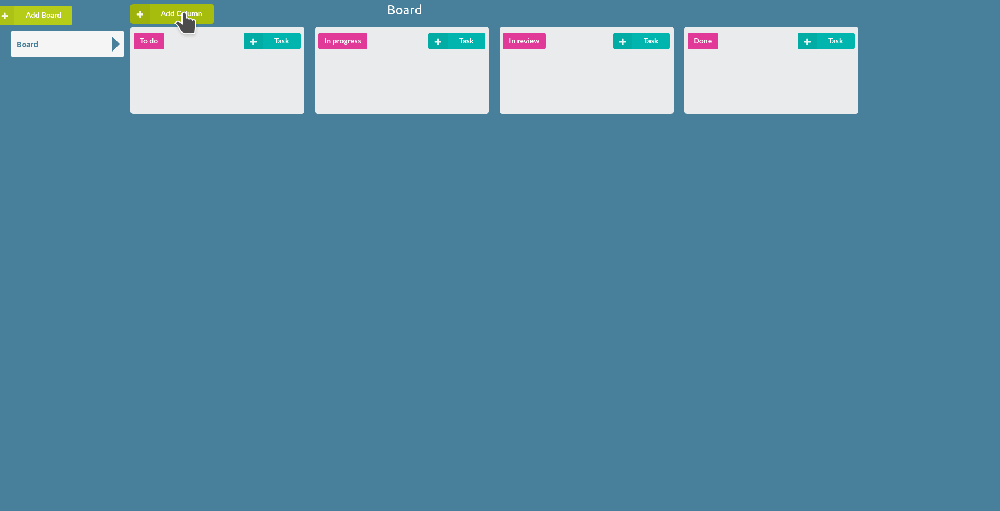
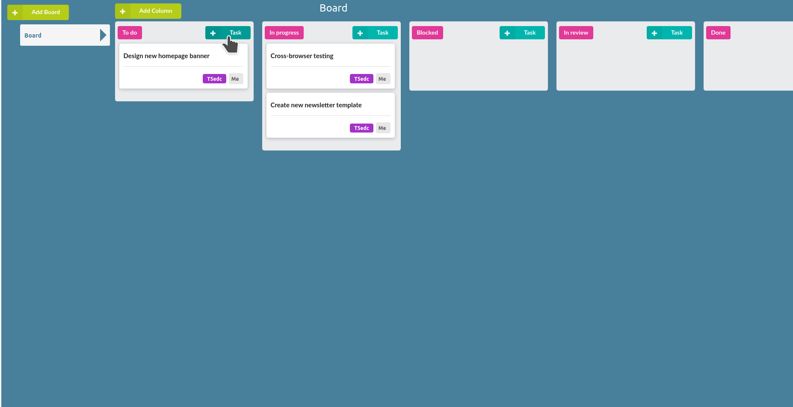
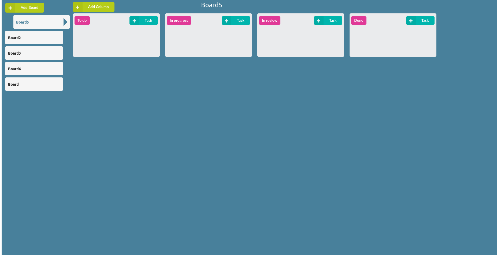
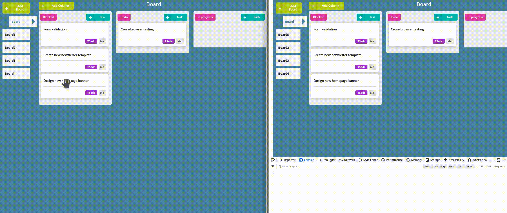

# Ongoing Kanban React-Node.js pet project

## How to run:

```sh
$ docker-compose up
```

## Running tests:

Server:

```sh
$ cd server/
$ npm test
```

Client:

```sh
$ cd client/
$ npm test
```

and follow the instructions.

### Next steps:

- [ ] Frontend Overhaul.
- [ ] Bring back reducer tests removed after major refactor.
- [ ] Allow Boards to be modified and deleted.
- [ ] Implement login.
- [ ] Extend task contents.
- [ ] ...


## Examples:

### Create and move column:



### Create and move task



### Select and move board



### Real time websockets update

